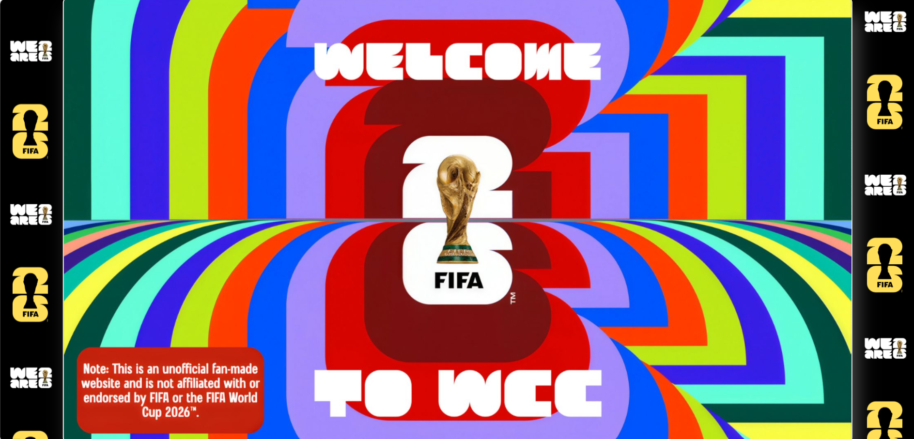
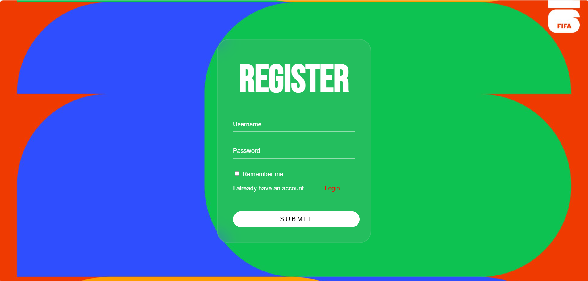
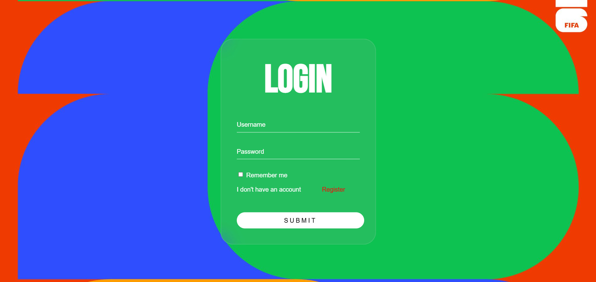
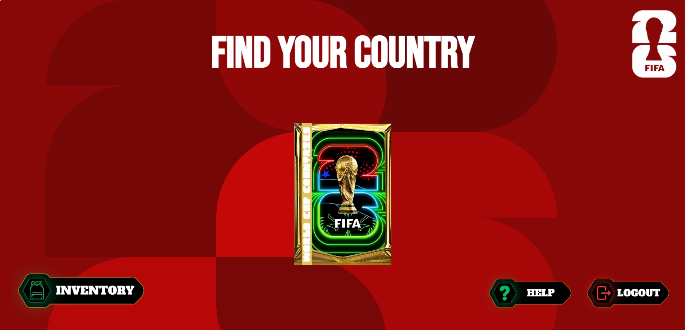
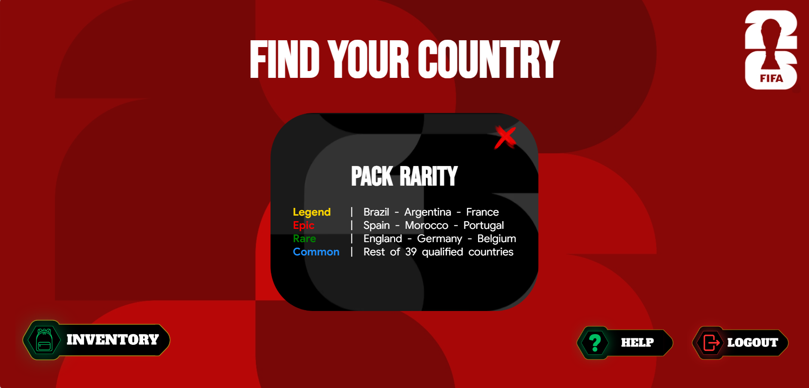
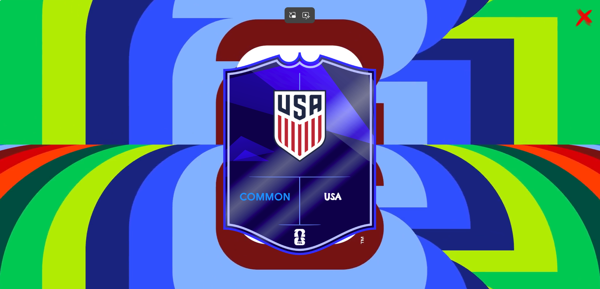
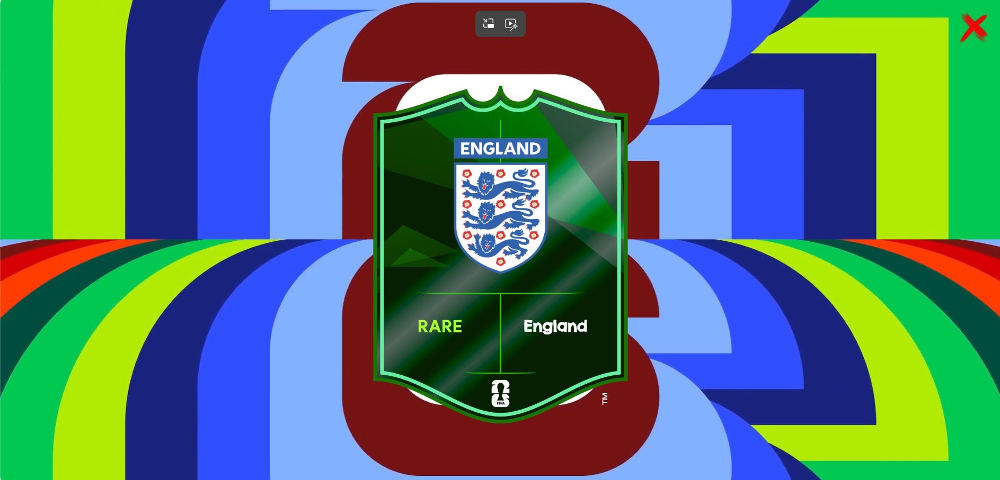
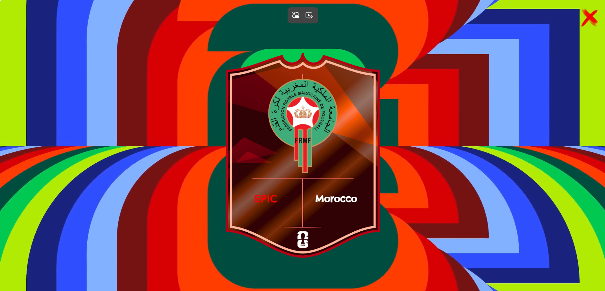
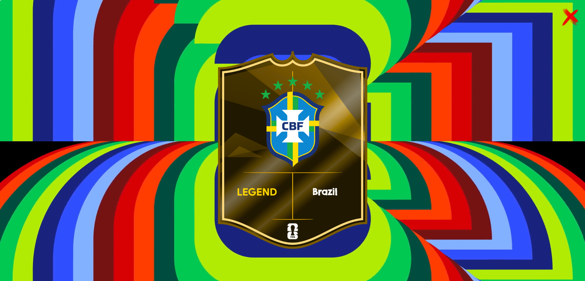
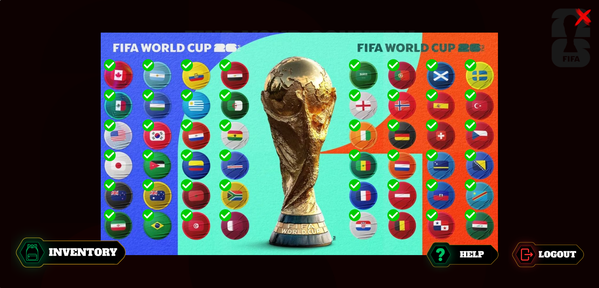

<h1 align="center">WCC : Website in HTML & CSS & JS</h1>

WCC is an abbreviation for World Cup Countries and it's a website where you open packs to collect all qualified countries for the World Cup. Everything is saved securely in Firebase.

## Table of content

- [Demo](#demo)
- [How To Play](#how-to-play)
  - [Create an account](#create-an-account)
  - [Log in to your account](#log-in-to-your-account)
  - [Home page](#home-page)
  - [Open a pack](#open-a-pack)
  - [Rarity system](#rarity-system)
     - [Common](#common)
     - [Rare](#rare)
     - [Epic](#epic)
     - [Legend](#legend)
  - [Check your collection](#check-your-collection)
- [Tech Stack](#tech-stack)
- [Compatibility](#compatibility)
- [How I built this](#how-i-built-this)
- [Why I built this](#why-i-built-this)
- [Author](#author)

## Demo

Link here --> [xtrawalo.github.io/WCC](https://xtrawalo.github.io/WCC)

**Note:** This website is only for PCs with 1920x1080 resolution.

Open packs, try your luck, and collect countries

## How to play

### Create an account
Register with a username and password. Data saved in Firebase Auth - No one can see your password.

### Log in to your account
Log in with the same username and password you registered with. You'll find all countries you've collected.

### Home page

### Open a pack
Click on the pack to open it.

### Rarity system

#### Common
- Rest 39 countries : 1.19% — 2.38%

#### Rare
- England : 0.179%
- Germany : 0.238%
- Netherlands : 0.358%

#### Epic
- Spain : 0.024%
- Morocco : 0.048%
- Portugal : 0.095%

#### Legend
- France : 0.010%
- Argentina : 0.004%
- Brazil : 0.001%

### Check your collection
Check your collection and unlock all countries.

## Tech Stack

- Vanilla JavaScript, HTML, CSS.
- Firebase Authentication
- Firebase Firestore

## Compatibility

- PC only
- Recommended resolution: **1920×1080**

## How I built this

- 30% AI (Chatgpt & Claude) — Rarity algorithm, pack opening logic, inventory unlock
- 35% YouTube Tutorials — Login & Register pages, Firebase setup
- 35% My own knowledge — Most of the HTML and CSS, overall design

## Why I built this
This project is for #horizons program by hackclub.
**The Goal:** To improve my front-end development skills by creating a pack-opening game related to the 2026 World Cup.

## Author

Me : [xtrawalo](https://github.com/xtrawalo)
